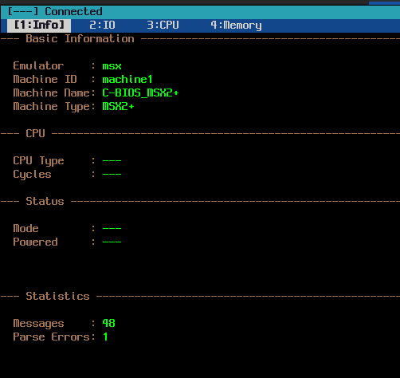
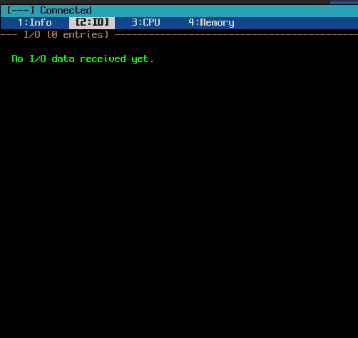
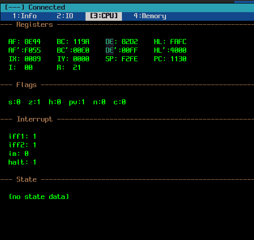
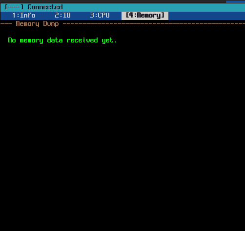
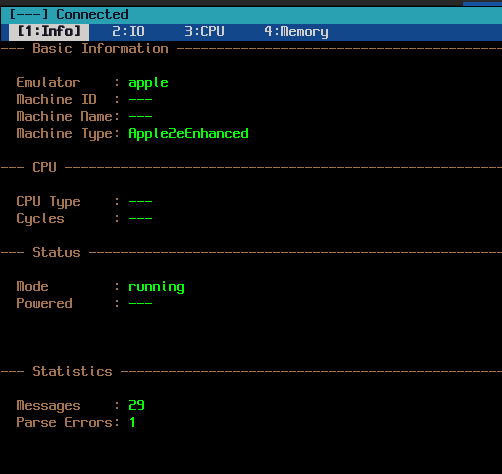
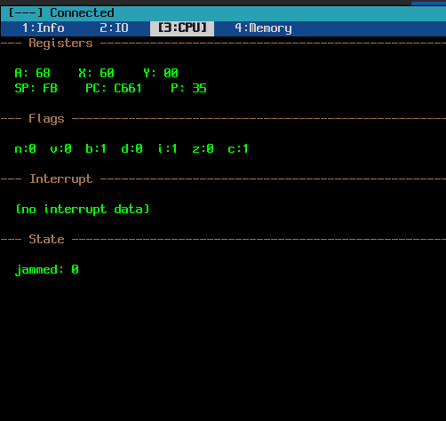

# rdemonitor

Retro Developer Environment Monitor - AppleWin/openMSX 에뮬레이터용 디버그 모니터링 도구

## 개요

`rdemonitor`는 AppleWin(Apple II)과 openMSX(MSX) 에뮬레이터의 디버그 출력을 실시간으로 모니터링하는 ncurses 기반 터미널 UI 프로그램입니다.

에뮬레이터가 TCP 소켓을 통해 전송하는 JSON Lines 형식의 디버그 데이터를 수신하여 4개의 탭으로 구분된 화면에 표시합니다.

## 주요 기능

- **실시간 모니터링**: TCP 소켓을 통해 에뮬레이터 디버그 데이터 수신
- **4개 탭 UI**: 기본정보, I/O, CPU, Memory 탭으로 구분
- **검색 기능**: 각 탭별 검색 및 하이라이트
- **스냅샷 저장**: 현재 상태를 텍스트 파일로 저장
- **로그 기능**: 수신된 모든 데이터를 파일로 기록
- **자동 재연결**: 연결 끊김 시 자동 재연결 시도

## 스크린샷

### MSX (openMSX)

| Tab 1: Info | Tab 2: IO |
|:-----------:|:---------:|
|  |  |

| Tab 3: CPU | Tab 4: Memory |
|:----------:|:-------------:|
|  |  |

### Apple II (AppleWin)

| Tab 1: Info | Tab 2: IO |
|:-----------:|:---------:|
|  |  |

| Tab 3: CPU | Tab 4: Memory |
|:----------:|:-------------:|
|  |  |

## 빌드

### 의존성

```bash
# Ubuntu/Debian
sudo apt install build-essential libncurses-dev libcjson-dev
```

### 컴파일

```bash
make
```

### 설치 (선택)

```bash
sudo make install
```

## 사용법

### 기본 실행

```bash
./rdemonitor
```

기본값: `localhost:6502`에 연결 시도

### 명령줄 옵션

```bash
./rdemonitor [OPTIONS]

Options:
  --debug_address=ADDR  디버그 서버 주소 (기본값: localhost)
  --debug_port=PORT     디버그 서버 포트 (기본값: 6502)
  --log_all=BOOL        모든 데이터 로그 (기본값: false)
  --help, -h            도움말 표시
```

### 사용 예시

```bash
# 특정 서버에 연결
./rdemonitor --debug_address=192.168.1.100 --debug_port=65505

# 로그 활성화
./rdemonitor --log_all=true

# 로컬 openMSX에 연결
./rdemonitor --debug_port=6809
```

## 설정 파일

설정 파일은 다음 순서로 검색됩니다:
1. `./rdemonitor.config` (현재 디렉토리)
2. `~/.rdemonitor.config` (홈 디렉토리)

명령줄 옵션이 설정 파일보다 우선합니다.

### 설정 파일 형식

```ini
# rdemonitor.config
debug_address=localhost
debug_port=6502
log_all=false
```

설정 파일이 없으면 `~/.rdemonitor.config`에 기본 파일이 자동 생성됩니다.

## 화면 구성

```
┌─────────────────────────────────────────────────────────────┐
│ [MSX] Connected                            CAPS: OFF        │
├─────────────────────────────────────────────────────────────┤
│ [1:Info]  2:IO   3:CPU   4:Memory                           │
├─────────────────────────────────────────────────────────────┤
│                                                             │
│                     (탭 내용 영역)                           │
│                                                             │
├─────────────────────────────────────────────────────────────┤
│ !@#$:Tab | f:Search | s:Snapshot | q:Quit                   │
└─────────────────────────────────────────────────────────────┘
```

## 키 바인딩

| 키 | 기능 |
|---|------|
| `!` 또는 `1` | Tab 1 (Info) 전환 |
| `@` 또는 `2` | Tab 2 (IO) 전환 |
| `#` 또는 `3` | Tab 3 (CPU) 전환 |
| `$` 또는 `4` | Tab 4 (Memory) 전환 |
| `f` | 검색 다이얼로그 열기 |
| `s` | 스냅샷 저장 |
| `q` | 프로그램 종료 |
| `↑` / `↓` | Memory 탭 스크롤 (1줄) |
| `PgUp` / `PgDn` | Memory 탭 스크롤 (1페이지) |
| `Home` / `End` | Memory 탭 처음/끝으로 이동 |
| `ESC` | 검색 취소 / 다이얼로그 닫기 |

## 탭 설명

### Tab 1: Info (기본정보)

에뮬레이터와 머신에 대한 기본 정보를 표시합니다.

- 에뮬레이터 버전 (AppleWin/openMSX)
- 머신 ID, 이름, 타입
- CPU 타입 (6502/65C02/Z80/R800)
- 실행 상태, 비디오 모드
- 연결 시간, 메시지 통계
- **[V01.1]** Memory Flags (AppleWin: 80store, auxRead 등)
- **[V01.1]** Text Screen 미리보기 (상위 4줄)

### Tab 2: IO (입출력)

I/O 포트 및 소프트 스위치 정보를 표시합니다.

- 최대 2048개 항목 버퍼
- 최신 데이터가 아래쪽에 표시
- 동일한 주소의 데이터는 업데이트 (replace)
- **[V01.1]** Annunciator 상태 (AppleWin: ANN0~ANN3)

### Tab 3: CPU (레지스터)

CPU 레지스터, 플래그, 인터럽트 상태를 표시합니다.

- 6502/65C02 (Apple): A, X, Y, SP, PC, P, 플래그
- Z80/R800 (MSX): AF, BC, DE, HL, IX, IY, SP, PC, 플래그
- 동일 레지스터는 값만 업데이트 (replace)
- **[V01.1]** CPU Stack (AppleWin: SP, Depth, 스택 엔트리)
- **[V01.1]** Disassembly (역어셈블 라인)

### Tab 4: Memory (메모리)

Hex 에디터 스타일로 메모리 덤프를 표시합니다.

- 16바이트/줄 형식
- ASCII 표현 포함
- 스크롤 지원 (키보드 네비게이션)
- 동일 주소의 데이터는 업데이트 (replace)
- 무제한 메모리 라인 저장
- **[V01.1]** Zero Page 요약 (상위 16바이트)
- **[V01.1]** Stack Page 요약 (상위 16바이트)

## 파일 출력

### 스냅샷 파일

`s` 키를 누르면 현재 상태가 저장됩니다.

- 파일명: `emulator_snap_YYYYMMDDHHmmss.tsnap`
- 형식: 텍스트 (모든 탭 내용 포함)
- Memory 탭은 전체 메모리 덤프 포함

### 로그 파일

`--log_all=true` 옵션 시 수신된 모든 JSON 데이터가 기록됩니다.

- 파일명: `emulator_log_YYYYMMDDHHmmss.log`
- 형식: 타임스탬프 + 원본 JSON 라인

## 데이터 프로토콜

이 프로그램은 `RetroDeveloperEnvironmentProject_OUTPUT_SPEC_V01` 규격을 따릅니다.

### JSON Lines 형식

```json
{"emu":"msx","cat":"cpu","sec":"reg","fld":"pc","val":"C600"}
{"emu":"apple","cat":"mem","sec":"dump","fld":"data","val":"A9208500","addr":"C600","len":4}
```

### 카테고리

| cat | 설명 | 저장 탭 |
|-----|------|--------|
| `sys` | 시스템 메시지 | Info |
| `mach` | 머신 정보 | Info |
| `cpu` | CPU 상태 | CPU |
| `io` | 입출력 | IO |
| `mem` | 메모리 | Memory |
| `dbg` | 디버거 | CPU |

### V01.1 확장 섹션 (AppleWin)

| cat | sec | 설명 | 저장 탭 |
|-----|-----|------|--------|
| `mem` | `zp` | Zero Page 덤프 | Memory |
| `mem` | `stackpage` | Stack Page 덤프 | Memory |
| `mem` | `flag` | 메모리 플래그 | Info |
| `mem` | `text` | 텍스트 화면 | Info |
| `io` | `ann` | 어나운시에이터 | IO |
| `dbg` | `disasm` | 역어셈블 | CPU |
| `cpu` | `stack` | CPU 스택 | CPU |

## 문제 해결

### 연결 실패

```
[---] Disconnected
```

- 에뮬레이터가 디버그 서버를 실행 중인지 확인
- 주소와 포트가 올바른지 확인
- 방화벽 설정 확인

연결이 끊기면 3초 간격으로 자동 재연결을 시도합니다.

### CAPS LOCK 표시 안됨

- 터미널에서 `/dev/tty` 접근 권한이 필요합니다
- X11 환경에서는 정상 작동하지 않을 수 있습니다

### 한글 깨짐

- 터미널이 UTF-8을 지원하는지 확인
- `LANG=ko_KR.UTF-8` 환경 변수 설정

## 프로젝트 구조

```
RetroDeveloperEnvironmentMonitor/
├── Makefile
├── README.md
├── rdemonitor.config.sample
├── src/
│   ├── main.c           # 진입점, 이벤트 루프
│   ├── config.c/h       # 설정 관리
│   ├── network.c/h      # TCP 통신
│   ├── parser.c/h       # JSON 파싱
│   ├── logger.c/h       # 로그 기능
│   ├── data_store.c/h   # 데이터 저장소
│   ├── ui.c/h           # ncurses UI
│   └── ui_tabs.c/h      # 탭 렌더링
└── obj/                 # 빌드 산출물
```

## 라이선스

이 프로젝트는 [GNU General Public License v2.0](LICENSE) 하에 배포됩니다.

## 관련 문서

- [RetroDeveloperEnvironmentProject_OUTPUT_SPEC_V01.md](./RetroDeveloperEnvironmentProject_OUTPUT_SPEC_V01.md) - 데이터 프로토콜 규격
- [DEV_PLAN.md](./DEV_PLAN.md) - 개발 계획서
